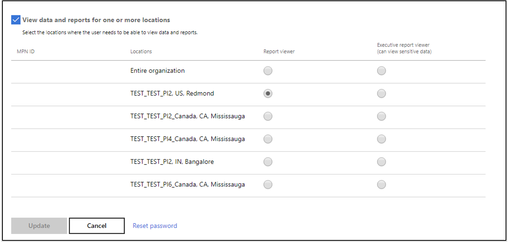
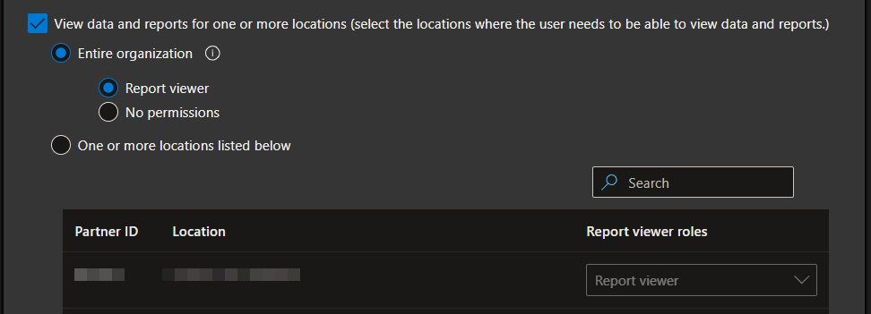
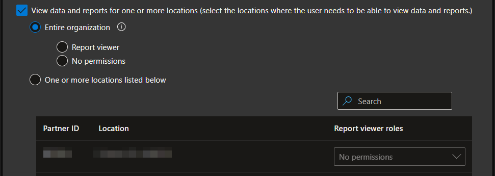

# Microsoft Partner Center - Executive Reports Role Assignments

## Summary

Provides a fix for Microsoft commercial partners and CSP resellers enrolled into the Microsoft AI Cloud Partner Program to allow user assignments into the otherwise missing "Executive report viewer" role in Partner Center.
A script is provided to hopefully make a quick fix accessible to other partners facing the same issue.

This effort was completed with the hope that it will quickly become obsolete - assuming that Microsoft will fix the Partner Center "Account settings" pages that are otherwise broken here.

This may also serve well as an example project for calling the Microsoft Graph APIs and working with OAuth 2.0 with Microsoft Entra ID authentication from PowerShell, with no additional dependencies.

## Background

Microsoft's Partner Center documentation, the [Cloud product performance insights FAQ](https://learn.microsoft.com/en-us/partner-center/insights/insights-known-issues) makes a few references to both the "Report Viewer" and "Executive report viewer" roles.  At least one of these roles is required to see the "Insights hub".
It also [notes](https://learn.microsoft.com/en-us/partner-center/insights/insights-known-issues#i-am-unable-to-see-billed-revenue-or-azure-consumed-revenue-acr-data-in-my-reports-why-is-that):

> I am unable to see Billed Revenue or Azure Consumed Revenue (ACR) data in my reports. Why is that?
>
> Billed Revenue and ACR data is available only to users who are Executive report viewers. For more information about roles, see [Membership role-based access](https://learn.microsoft.com/en-us/partner-center/insights/insights-roles).

That page, "CPP role-based access", further details these roles as they apply to "Cloud Product Performance" (CPP):

> * Executive report viewers have access to all reporting datasets.
> * Report viewers have access to all reporting datasets except those with sensitive data, such as revenue and customer/employee personal data.

It then illustrates how these different roles *should* be assigned:



As of this writing on 2025-02-08, that page was dated 2024-10-08.
4 months later, that documentation still does not reflect the current actual experience as shown:



Note that a user already granted the "Executive report viewer" role will show these options in an indeterminate status, where only 2 of the expected 3 options are visible, with both available options unselected:



Selecting either option here and then saving the page will result in the "Executive report viewer" role being lost, and with no ability to re-assign it through the web UI.

Note that the per-location permissions also incorrectly display as "No permissions" - which also does not reflect the actual working state.

Most other options on the same page (organization account management, referrals, assists your customers, incentives) have 3 options instead of 2 - so it appears quite likely this is a simple disconnect between the front-end and back-end development teams responsible for Partner Center.

These roles are also documented under:

* "Account settings" / "Manage users" / "[Assign roles, permissions, and workspace access](https://learn.microsoft.com/en-us/partner-center/account-settings/permissions-overview)", under the "[Executive report viewer role](https://learn.microsoft.com/en-us/partner-center/account-settings/permissions-overview#executive-report-viewer-role)" section.
* "Insights" / "Cloud product performance insights" / "Cloud product performance report details" / "[CPP Summary](https://learn.microsoft.com/en-us/partner-center/insights/insights-overview-report)".

### Support Ticket

A Partner Center support ticket, # [2501160040016582](https://partner.microsoft.com/dashboard/v2/support/servicerequests/activity?tid=2501160040016582), was opened with Microsoft on 2025-01-16.
It was closed without resolution after working through the issue ourselves - directly through the Partner Center APIs, and bypassing the Partner Center web pages - as further documented here.

## Execution

Download and run [executive-reports-assign.ps1](executive-reports-assign.ps1).

### Parameters

This requires a few mandatory parameters:

* `tenantId`
* `appId`
* `userId`

Both the `tenantId` and `appId` can be found from <https://partner.microsoft.com/en-us/dashboard/account/v3/appmanagement>.
Use the "Account ID" as the `tenantId`.

The `userId` specifies one or more users, each identified by either a User Principal Name (UPN) or Object ID (in GUID format).
To specify multiple users using command-line arguments, separate them with commas.

### Example Usage

```powershell
.\executive-reports-assign.ps1 `
	-tenantId 'e316fc6f-fadb-4d5f-9385-a87529ecd697' `
	-appId 'c1db92f7-8438-4471-adf1-280017138c44' `
	-userId 'user@example.com','1b074826-5f85-4b2e-aaf1-8eb693c2d757'
```

(*Wrapped to multiple-lines here only for readability, backticks required for line continuations.*)

### Authentication

The script uses the "[OAuth 2.0 device authorization grant flow](https://learn.microsoft.com/en-us/entra/identity-platform/v2-oauth2-device-code)" ("device code") authentication.
Follow the directions when prompted.

1. This requires "Allow public client flows", "Enable the following mobile and desktop flows" to be set to "Yes" within the Entra ID App Registration for the Partner Center "Web App".
	1. See the bottom of <https://learn.microsoft.com/en-us/entra/identity-platform/scenario-desktop-app-registration> for further details and instructions.

This has only been tested using a "[Global Admin](https://learn.microsoft.com/en-us/partner-center/account-settings/permissions-overview#global-admin-role)" role in Entra ID.  In theory, the "Account admin" role should also work - as detailed at <https://learn.microsoft.com/en-us/partner-center/account-settings/permissions-overview#account-admin-role>.

## Dependencies

1. [PowerShell](https://learn.microsoft.com/en-us/powershell/) - version 5.1 or later.
	1. Tested under both PowerShell 5.1 and 7.5.
	2. PowerShell 7 or higher is recommended.

## Partner Center API asides

The accessibility of the Partner Center API remains problematic, particularly from PowerShell - which would ideally be suitable for "quick fix" operations such as this effort.

1. The original "PartnerCenterPowerShellModule" (<https://github.com/microsoft/PartnerCenterPowerShellModule>) had its last commit on 2018-10-04, and was archived on 2023-11-16 with a note that it was replaced by a new project, "Partner-Center-PowerShell".
That project (<https://github.com/Microsoft/Partner-Center-PowerShell>) had its last commit on 2021-02-11, and was archived on 2024-07-22 with no documented reason or recommended replacement.
2. MSAL.PS (<https://github.com/AzureAD/MSAL.PS>) was never supported by Microsoft, had its last commit on 2023-08-01, and was archived on 2023-09-22.
3. At least some of the Partner Center APIs declare a `Content-Type: application/json; charset=utf-8` in the response headers, but then also include a byte-order-mark (BOM) that wreck havoc with `Invoke-RestMethod` (and `ConvertFrom-Json`) in PowerShell.
See `Convert-PCFixEncoding` for the work-around used in the source code here and the comments documented along with it.

## Author

Mark Ziesemer, CISSP, CCSP, CSSLP

* 🌐 <https://www.ziesemer.com>
* 🔗 <https://www.linkedin.com/in/ziesemer/>
